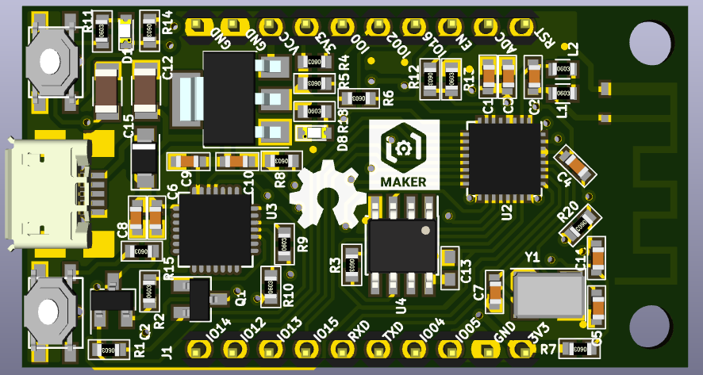

# esp8266_iotmaker

## Features

ESP8266 IOTMAKERVN:
- Size: 1.86x1 inch.
- Intergrate micro USB.
- Input Voltage: 5v (Vusb).
- Open hardware with CC-BY-SA license.
- Design with KiCad.

## Hardware

### Schematics

### PCB Layout

### 3D

### Pinout 

### Fritzing part 

### Gerber

[Download](./assets/esp8266.zip)

### BOM 

| Designator | Package | Quantity | Designation  | Nơi bán  |
|-------------------------|--------------------------------|----------|--------------|--------------|
| U1                      | USB_Micro-B                    | 1        | usb_mini_b   |[thegioiic](http://thegioiic.com/products/microusb-fm-v2)|
| U2                      | QFN-32-1EP_5x5mm_Pitch0.5mm    | 1        | ESP8266ES    |    						       |
| U3                      | QFN-28-1EP_5x5mm_Pitch0.5mm    | 1        | CP2102       |[thegioiic](http://thegioiic.com/products/cp2102)        |
| U4                      | SOIC-8_3.9x4.9mm_Pitch1.27mm   | 1        | SLASH 4MB    |[banlinhkien](http://banlinhkien.vn/goods-5796-w25q32fv-sop8-ic-flash-32mbit.html) |
| U6                      | SOT-223                        | 1        | AMS1117/3V3  |[thegioiic](http://thegioiic.com/products/ams1117-3-3v)  |
| D1,D8                   | LED_0603                       | 2        | LED_Blue     |[thegioiic](http://thegioiic.com/products/bl-0603-led)   |
| Y1                      | Crystal_SMD_2016-4pin_2.0x1.6mm| 1        | 26MHz   |[thegioiic](http://thegioiic.com/products/26mhz-crystal-c5032)|
| Q1,Q2                   | SOT-23                         | 2        | S8050        |[banlinhkien](http://banlinhkien.vn/goods-4708-s8050-sot23-trans-npn-0-5a-40v-smd-j3y-.html)|
| L1,L2                   | L_0603                         | 2        |              |
| C1,C6,C9                | C_0603                         | 3        | 10uF      |[thegioiic](http://thegioiic.com/products/10uf-16v-0603-cap)|
| C3,C8,C10,C11,C13       | C_0603                         | 5        | 100nF    |[thegioiic](http://thegioiic.com/products/100nf-16v-0603-cap)|
| C5,C7                   | C_0603                         | 2        | 10pF     |[thegioiic](http://thegioiic.com/products/10pf-50v-0603-cap)|
| C12,C15                 | C_1206                         | 2        | 10uF Tant    |[lkbk](http://linhkienbachkhoa.com/san-pham/tu-tantalum-10uf-16v-1206-10-3ohm/)|
| C2                      | C_0603                         | 1        | 5,6pF        |[thegioiic](http://thegioiic.com/products/6-8pf-50v-0603-cap)|
| R1,R2,R4,R5,R6,R7,R8    | R_0603                         | 7        | 10K          |[thegioiic](http://thegioiic.com/products/10k-ohm-0603-1)|
| R9,R10,R11,R14,R15      | R_0603                         | 5        | 470R         |[thegioiic](http://thegioiic.com/products/470-ohm-0603-1)|
| R12                     | R_0603                         | 1        | 220k/1%     |[thegioiic](http://thegioiic.com/products/220k-ohm-0603-1)|
| R13                     | R_0603                         | 1        | 100k/1%     |[thegioiic](http://thegioiic.com/products/100k-ohm-0603-1)|
| R3                      | R_0603                         | 1        | 220R         |[thegioiic](http://thegioiic.com/products/220-ohm-0603-1)|
| R18                     | R_0603                         | 1        | 100R         |[thegioiic](http://thegioiic.com/products/100-ohm-0603-1)|
| R20                     | R_0603                         | 1        | 2k           |[thegioiic](http://thegioiic.com/products/2k-ohm-0603-1)|
| D5                      | D_SOD-123                      | 1        | 1N5819       |[banlinhkien](http://banlinhkien.vn/goods-5519-diode-s4-sod123-1n5819-sod123-.html)|
| SW1,SW2                 | SWITCH SMD                     | 2        | TACTICLE SW  |[thegioiic](http://thegioiic.com/products/ts-1189e)|
| J1,J2                   | Pin_Header_Straight_1x10       | 2        | CONN_01X10   |

### Remark

This project was in development phase - we will remove this remark after release

# License

