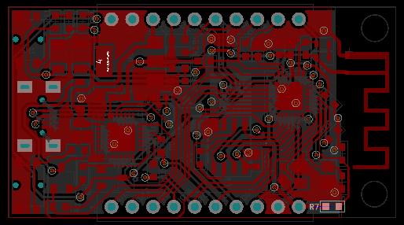

# esp8266_iotmaker

## Features

ESP8266 IOTMAKERVN:
- Intergrate micro USB.
- Input Voltage: 5v (Vusb).
- Open hardware with CC-BY-SA license.
- Design with KiCad.

## Hardware

### Schematics

### PCB Layout

### 3D

### Pinout 

### Fritzing part 

### Gerber

[Download](./assets/esp8266.zip)

### BOM 

| Designator | Package | Quantity | Designation  |
|-----------------------------------|--------------------------------|----------|--------------|
| U1                                | USB_Micro-B                    | 1        | usb_mini_b   |
| U2                                | QFN-32-1EP_5x5mm_Pitch0.5mm    | 1        | ESP8266ES    |
| U3                                | QFN-28-1EP_5x5mm_Pitch0.5mm    | 1        | CP2102       |
| U4                                | SOIC-8_3.9x4.9mm_Pitch1.27mm   | 1        | SLASH 4MB    |
| U6                                | SOT-223                        | 1        | AMS1117/3V3  |
| D1,D8                             | LED_0603                       | 2        | LED_Blue     |
| Y1                                | Crystal_SMD_2016-4pin_2.0x1.6mm| 1        | 26MHz        |
| Q1,Q2                             | SOT-23                         | 2        | S8050        |
| L1,L2                             | L_0603                         | 2        |              |
| C1,C6,C9                          | C_0603                         | 3        | 10uF         |
| C3,C8,C10,C11,C13                 | C_0603                         | 5        | 100nF        |
| C5,C7                             | C_0603                         | 2        | 10pF         |
| C12,C15                           | C_1206                         | 2        | 10uF Tant    |
| C2                                | C_0603                         | 1        | 5,6pF        |
| R1,R2,R4,R5,R6,R7,R8              | R_0603                         | 7        | 10K          |
| R9,R10,R11,R14,R15                | R_0603                         | 5        | 470R         |
| R12                               | R_0603                         | 1        | 220k/1%      |
| R13                               | R_0603                         | 1        | 100k/1%      |
| R3                                | R_0603                         | 1        | 200R         |
| R18                               | R_0603                         | 1        | 100R         |
| R20                               | R_0603                         | 1        | 2k           |
| D5                                | D_SOD-123                      | 1        | 1N5819       |
| SW1,SW2                           | SWITCH SMD                     | 2        | TACTICLE SW  |
| J1,J2                             | Pin_Header_Straight_1x10       | 2        | CONN_01X10   |

### Remark

This project was in development phase - we will remove this remark after release

# License

